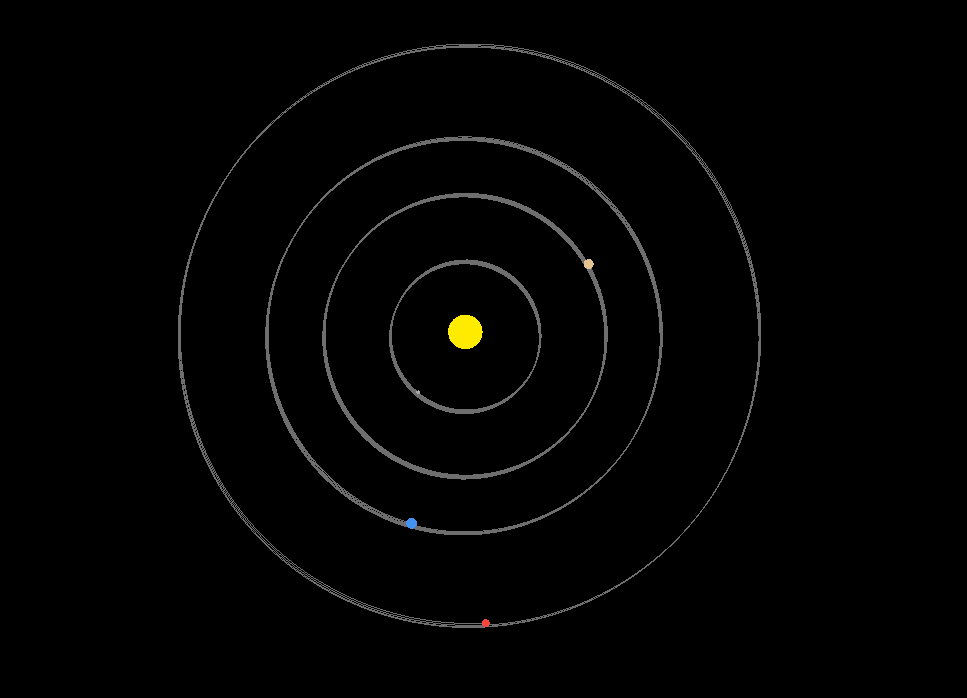
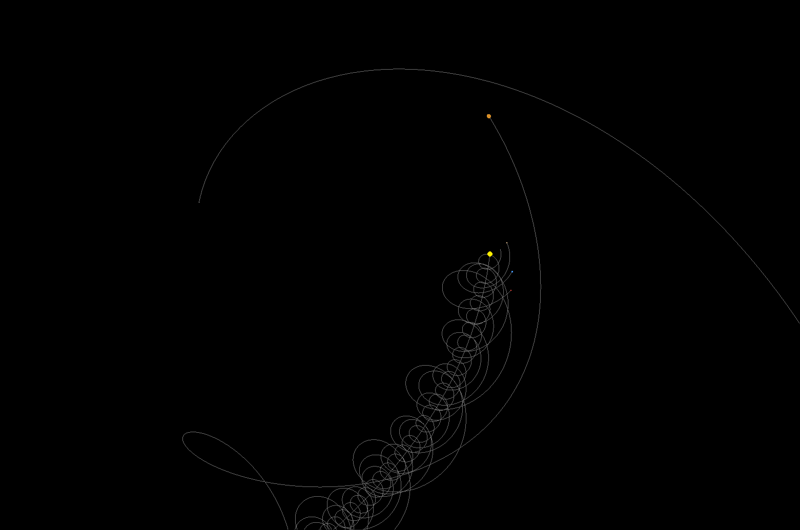

# Solar System
A small program that simulates the orbits of planets around the sun in the solar system using C++ and OpenGL



# Building
Copy and clone the git url

Inside the directory create the build using cmake
```
mkdir build
cd build
cmake ..
```
Build using ```make``` on linux

Use ```cmake --build .``` on Windows

# Edit with ImGui
Press the 'c' key to open the settings window.
You can pause, toggle trail paths, or mess around with the planets.


